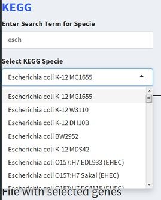

-   [Welcome to PathwayApp](#welcome-to-pathwayapp)
-   [Uploading your data](#uploading-your-data)
-   [Selecting species](#selecting-species)
-   [Scenario 1: ORA Analysis. GO
    Database.](#scenario-1-ora-analysis.-go-database.)
-   [Scenario 2: GSEA. GO Database.](#scenario-2-gsea.-go-database.)
-   [Scenario 3: ORA Analysis. KEGG
    Database.](#scenario-3-ora-analysis.-kegg-database.)
-   [Scenario 4: GSEA. KEGG Database.](#scenario-4-gsea.-kegg-database.)
-   [Scenario 5: ORA Analysis. KEGG
    Database.](#scenario-5-ora-analysis.-kegg-database.)
-   [Scenario 6: ORA Analysis. Reactome
    Database.](#scenario-6-ora-analysis.-reactome-database.)

Welcome to PathwayApp
=====================

PathwayApp is an application to follow-up microarray experiment in order
to get biological sense of expression data. User can choose between
three annotation data bases and two statistical methods to find
differentially expressed pathways. The three annotation databases are:
Gene Ontology (GO), KEGG and Reactome. The two statistical methods are:
ORA (Overexpression Analysis) and GSEA (Gene Set Enrichment Analysis).

Uploading your data
===================

To get started you need to upload two comma delimited csv files:

1.  File with all genes from your experiment;

2.  File with a set of differentially expressed genes.

Each file should include two columns:

1.  Entrez ID

2.  LogRatios

**Note:** both files should include a header row. The order of the
variables matters: first column should be **Entrez ID** and the second
**LogRatios**. On the other hand, the names of the variable don't
matter.

If you want to perform only GSEA analysis you don't need to upload the
file with differentially expressed genes.

Selecting species
=================

You can choose between three manually curated databases to reference
your genes:

1.  Gene Ontology
2.  Reactome
3.  KEGG

Available species differ between three options. The most exhaustive is
KEGG database, because KEGG pathways are downloaded on the fly, while
annotations for GO and Reactome are stored locally on the server via
Bioconductor Annotation Databases.

To find the specie of interest in KEGG database you can use text field
atop of KEGG dropdown menu using a string from scientific notation:

Scenario 1: ORA Analysis. GO Database.
======================================

Assume you want to conduct overexpression analysis and annotate your
genes using GO Database.

1.  You need to select **Data input** on the left.
    -   Under *Select Species* → *GO* select the genome to that you want
        annotate your genes.
    -   At the bottom of the page under *Upload Data* upload the coma
        delimited .csv *file of all the genes* from your experiment.
        Please follow instructions of what the file should contain.
    -   Upload the coma delimited .csv *file of selected genes*. Follow
        instruction of what the file should contain.
    -   Check gene numbers in the output that appears when data are
        uploaded. Are the first 10 observations displayed correctly?
        Does the total number of genes correspond to data from your
        experiment?
2.  From the menu on the left select **Go Analysis** and subitem
    **ORA**.
    -   Select between three domains: *Cellular components*, *Molecular
        function* or *Biological process*.
    -   Select adjustment method.
    -   Select P value threshold.
    -   Click on the button *Calculate Result*.
    -   Calculation may take some time. As an output you get a table
        with statistics. There appears a button to download results.
        Near the button click on the question mark to get help on the
        statistics in the table.
3.  Visualize the result.
    -   **Bar plot**. Click on the subitem *Bar Plot* on the left. You
        can choose the number of top categories displayed. You can
        specify download parameters for the image. To get optimal result
        you may try different parameters.
    -   **Dot plot**. Click on the subitem *Dot Plot* on the left.
    -   **Enrichment plot**. Click on the subitem *Enrichment Plot* on
        the left.
    -   **Category-Gene-Network**. Click on the subitem
        *Category-Gene-Network* on the left.
    -   **GO plot**. Click on the subitem *Goplot* on the left.

Scenario 2: GSEA. GO Database.
==============================

1.  You need to select **Data input** on the left.
    -   Under *Select Species* select the genome to that you want to
        annotate your genes.
    -   At the bottom of the page under *Upload Data* upload the coma
        delimited .csv *file of all the genes* from your experiment.
        Please follow instructions of what the file should contain.
    -   Check gene numbers in the output that appears when data are
        uploaded. Are the first 10 observations displayed correctly?
        Does the total number of genes correspond to data from your
        experiment?
2.  From the menu on the left select **Go Analysis** and subitem
    **GSEA**.
    -   Select between three domains: *Cellular components*, *Molecular
        function* or *Biological process*.
    -   Select adjustment method.
    -   Select P value threshold.
    -   Click on the button *Calculate Result*.
    -   Calculation may take some time. As an output you get a table
        with statistics. There appears a button to download results.
        Near the button click on the question mark to get help on the
        statistics in the table. If the resulting table is empty no
        significant pathway was found. Adjust input parameters like P
        Value or adjustment method to see whether there are less
        significant pathways.
3.  Visualize the result.
    -   **GSEA Plot**. Clic on the subitem *GSEA plot*. If none of the
        pathways was found in step 1 you will see an error message that
        an attempt was made to select less than one element in
        get1index.

Scenario 3: ORA Analysis. KEGG Database.
========================================

Assume you want to conduct overexpression analysis and annotate your
genes using KEGG Database. **Important:** you need an internet
connection to annotate your date via KEGG. Otherwise you get an error:

'species' should be one of organisms listed in
'<http://www.genome.jp/kegg/catalog/org_list.html>'...

If you have internet connection, follow following steps:

1.  You need to select **Data input** on the left.
    -   Under *Select Species* → *KEGG* select the genome to that you
        want annotate your genes. To find genome search in the field
        *Enter Search Term for Specie* a string from scientific name of
        the species. For instance, a search for *homo* will return *Homo
        sapiens* in the field *Select KEGG Specie*. Or the search for
        *esche* will return a long list with different *escherichia
        coli* annotation genomes.
    -   At the bottom of the page under *Upload Data* upload the coma
        delimited .csv *file of all the genes* from your experiment.
        Please follow instructions of what the file should contain.
    -   Upload the coma delimited .csv *file of selected genes*. Follow
        instruction of what the file should contain.
    -   Check gene numbers in the output that appears when data are
        uploaded. Are the first 10 observations displayed correctly?
        Does the total number of genes correspond to data from your
        experiment?
2.  From the menu on the left select **KEGG Analysis** and subitem
    **ORA**.
    -   Select adjustment method.
    -   Select P value threshold.
    -   Click on the button *Calculate Result*.
    -   Calculation may take some time. As an output you get a table
        with statistics. There appears a button to download results.
        Near the button click on the question mark to get help on the
        statistics in the table.
3.  Visualize the result.
    -   **Bar plot**. Click on the subitem *Bar Plot* on the left. You
        can choose the number of top categories displayed. You can
        specify download parameters for the image. To get optimal result
        you may try different parameters.
    -   **Dot plot**. Click on the subitem *Dot Plot* on the left.
    -   **Enrichment plot**. Click on the subitem *Enrichment Plot* on
        the left.
    -   **Category-Gene-Network**. Click on the subitem
        *Category-Gene-Network* on the left.
    -   **KEGG Pathway**. Click on the subitem *KEGG Pathway* on the
        left. Automatically the image of the most significant pathway
        from the analysis will appear. Use drop down menu to select
        another pathway to visualize.

Scenario 4: GSEA. KEGG Database.
================================

1.  You need to select **Data input** on the left.
    -   Under *Select Species* → *KEGG* select the genome to that you
        want annotate your genes.
    -   At the bottom of the page under *Upload Data* upload the coma
        delimited .csv *file of all the genes* from your experiment.
        Please follow instructions of what the file should contain.
2.  From the menu on the left select **KEGG Analysis** and subitem
    **GSEA**.
    -   Select adjustment method.
    -   Select P value threshold.
    -   Click on the button *Calculate Result*.
    -   Calculation may take some time. As an output you get a table
        with statistics. There appears a button to download results.
        Near the button click on the question mark to get help on the
        statistics in the table. If the resulting table is empty no
        significant pathway was found. Adjust input parameters like P
        Value or adjustment method to see whether there are less
        significant pathways.
3.  Visualize the result.
    -   **GSEA Plot**. Click on the subitem *KEGG Analysis* → *GSEA
        plot*. If none of the pathways was found in step 1 you will see
        an error message that an attempt was made to select less than
        one element in get1index.

Scenario 5: ORA Analysis. KEGG Database.
========================================

Assume you want to conduct overexpression analysis and annotate your
genes using Reactome Database.

1.  You need to select **Data input** on the left.
    -   Under *Select Species* → *Reactome* select the genome to that
        you want to annotate your genes.
    -   At the bottom of the page under *Upload Data* upload the coma
        delimited .csv *file of all the genes* from your experiment.
        Please follow instructions of what the file should contain.
    -   Upload the coma delimited .csv *file of selected genes*. Follow
        instruction of what the file should contain.
    -   Check gene numbers in the output that appears when data are
        uploaded. Are the first 10 observations displayed correctly?
        Does the total number of genes correspond to data from your
        experiment?
2.  From the menu on the left select **Reactome Analysis** and subitem
    **ORA**.
    -   Select adjustment method.
    -   Select P value threshold.
    -   Click on the button *Calculate Result*.
    -   Calculation may take some time. As an output you get a table
        with statistics. There appears a button to download results.
        Near the button click on the question mark to get help on the
        statistics in the table.
3.  Visualize the result.
    -   **Bar plot**. Click on the subitem *Bar Plot* on the left. You
        can choose the number of top categories displayed. You can
        specify download parameters for the image. To get optimal result
        you may try different parameters.
    -   **Dot plot**. Click on the subitem *Dot Plot* on the left.
    -   **Enrichment plot**. Click on the subitem *Enrichment Plot* on
        the left.
    -   **Category-Gene-Network**. Click on the subitem
        *Category-Gene-Network* on the left.
    -   **Reactome Pathway**. Click on the subitem *KEGG Pathway* on the
        left. Automatically the most significant pathway is selected.
        Since visualization of Reactome Pathway may take a while, the
        analysis does not start automatically. You must click on the
        button *Show path* to start the calculation. Use drop down menu
        to select another pathway to visualize.

Scenario 6: ORA Analysis. Reactome Database.
============================================

1.  You need to select **Data input** on the left.
    -   Under *Select Species* → *Reactome* select the genome to that
        you want annotate your genes.
    -   At the bottom of the page under *Upload Data* upload the coma
        delimited .csv *file of all the genes* from your experiment.
        Please follow instructions of what the file should contain.
2.  From the menu on the left select **Reactome Analisis** and subitem
    **GSEA**.
    -   Select adjustment method.
    -   Select P value threshold.
    -   Clic on the button *Calculate Result*.
    -   Calculation may take some time. As an output you get a table
        with statistics. There appears a button to download results.
        Near the button click on the question mark to get help on the
        statistics in the table. If the resulting table is empty no
        significant pathway was found. Adjust input parameters like P
        Value or adjustment method to see whether there are less
        significant pathways.
3.  Visualize the result.
    -   **GSEA Plot**. Click on the subitem *KEGG Analysis* → *GSEA
        plot*. If none of the pathways was found in step 1 you will see
        an error message that an attempt was made to select less than
        one element in get1index.
