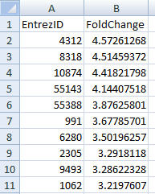

-   [Uploading your data](#uploading-your-data)
-   [Selecting species](#selecting-species)

Uploading your data
===================

To get started you need to upload two comda delimited csv files:

1.  File with all genes from your experiment;

2.  File with a set of differencially expressed genes.

Each file should include two columns:

1.  Entrez ID

2.  LogRatios

**Note:** both files should include a header row. The order of the
variables matters: first column should be **Entrez ID** and the second
**LogRatios**. On the other hand the names of the variable don't matter.

If you want to performe only GSEA analysis you don't need to upload the
file with differencially expressed genes.

Selecting species
=================

You can chose between three manually curated databases to reference your
genes:

1.  Gene Ontology
2.  Reactome
3.  KEGG

Available species differ between three options. The most exhaustive is
KEGG database, because KEGG patheways are donloaded on the fly, while
annotations for GO and Reactome are stored locally on the server via
Bioconductor Annotation Databases.

To find the specie of interes in KEGG database you can use text field
atop of KEGG dropdown menu using a string from scientific notation:

