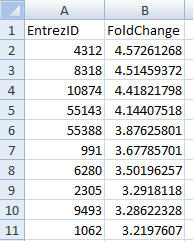

Uploading your data
===================

To get started you need to upload two comda delimited csv files:

1.  File with all genes from your experiment;

2.  File with a set of differencially expressed genes.

Each file should include two columns:

1.  Entrez ID

2.  LogRatios

**Note:** both files should include a header row. The order of the
variables matters: first column should be **Entrez ID** and the second
**LogRatios**. On the other hand the names of the variable don't matter.

If you want to performe only GSEA analysis you don't need to upload the
file with differencially expressed genes.
